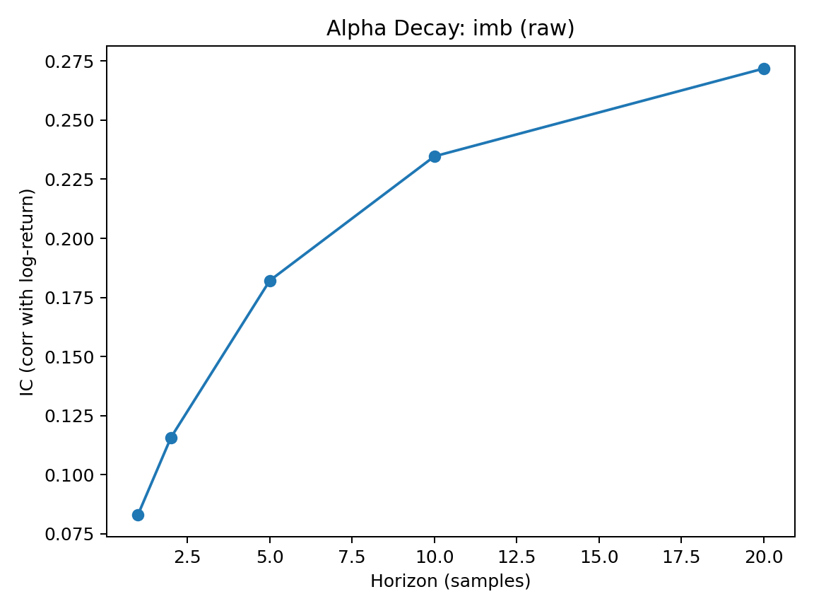
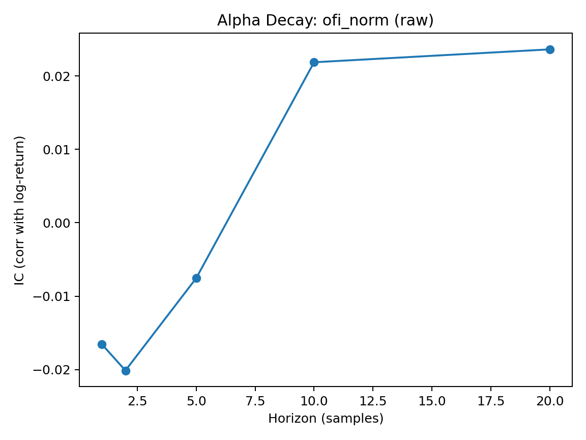
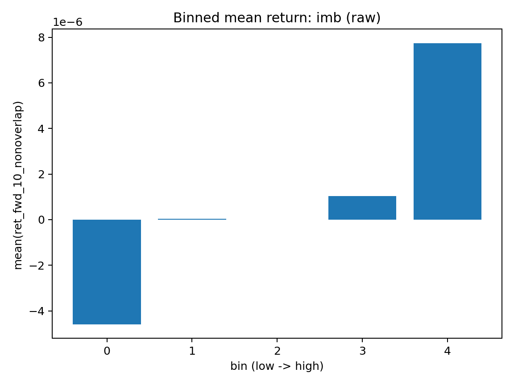
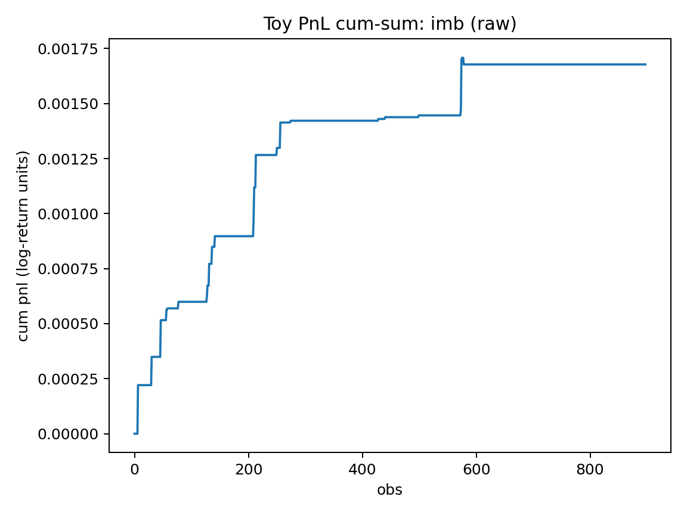

# Limit Order Book Alpha Research


A quantitative research project that collects **high-frequency limit order book (LOB) data**, constructs **liquidity-pressure features**, and evaluates their **short-horizon predictive power**.

This repository implements a complete microstructure research pipeline:

1. Market data collection from an exchange WebSocket
2. Order book reconstruction into evenly sampled snapshots
3. Feature engineering (depth imbalance, order-flow imbalance)
4. Alpha diagnostics (IC, decay curves, quantile tests, toy PnL)

The goal is to evaluate whether **order book pressure signals predict short-term price movements**.

---

# Research Summary

This study evaluates several microstructure signals derived from **Kraken L2 order book data**.

| Signal        | Information Coefficient | Interpretation           |
| ------------- | ----------------------- | ------------------------ |
| **Imbalance** | **0.228**               | Strong predictive signal |
| OFI_norm      | 0.049                   | Weak predictive power    |
| OFI_norm_clip | 0.044                   | Weak predictive power    |

Key observations:

* Order book **imbalance exhibits strong monotonicity** in quintile tests.
* A simple toy strategy based on imbalance produces **t-stat ≈ 3.47**.
* Order-flow imbalance proxies appear weaker under this dataset.

---

# Research Pipeline

```
Kraken WebSocket
        ↓
Order book reconstruction
        ↓
Feature engineering
        ↓
Alpha diagnostics
        ↓
Decay / Quintile / PnL analysis
```

---

# Repository Structure

```
lob-alpha-research
│
├── README.md
├── requirements.txt
│
├── src
│   ├── collect_kraken_l2.py
│   ├── build_features.py
│   └── analyze_alpha.py
│
├── data
│   └── figs
│       └── (generated plots)
│
└── notebooks
    └── exploratory_analysis.ipynb
```

Note:

Large datasets such as `.parquet` files are ignored via `.gitignore`.
Only **figures used in the README** are stored in the repository.

---

# Dataset

Example configuration used in the current run:

| Parameter               | Value         |
| ----------------------- | ------------- |
| Exchange                | Kraken        |
| Pair                    | XBT/USD       |
| Order book depth        | Top 10 levels |
| Sampling interval       | 200 ms        |
| Total observations      | 8986          |
| Non-overlapping samples | 898           |

Forward return target:

```
ret_fwd_10_nonoverlap
```

Using **non-overlapping targets** prevents artificial autocorrelation caused by overlapping windows.

---

# Features

## Order Book Imbalance

Measures liquidity pressure between bids and asks.

[
imb = \frac{V_{bid} - V_{ask}}{V_{bid} + V_{ask}}
]

Where:

* (V_{bid}) = total bid volume across depth levels
* (V_{ask}) = total ask volume across depth levels

Large positive imbalance indicates **buy-side pressure**.

---

## Order Flow Imbalance (OFI proxy)

Approximates directional pressure from order book changes.

Implemented variants:

```
ofi_norm
ofi_norm_clip
```

Normalized version:

```
ofi_norm = ofi / total_depth
```

---

# Alpha Diagnostics

The analysis pipeline evaluates:

1. **Information coefficient (IC)** between signals and future returns
2. **Alpha decay** across horizons
3. **Quantile monotonicity tests**
4. **Spread-filtered robustness checks**
5. **Toy strategy PnL diagnostics**

---

# Results

## 1) Imbalance alpha decay (important)



The signal decays quickly, consistent with **microstructure alpha behavior**.

---

## 2) OFI alpha decay (comparison)



OFI proxy exhibits weaker predictive structure compared with imbalance.

---

## 3) Binned forward returns (monotonicity test)



Higher imbalance quantiles correspond to **higher forward returns**, suggesting genuine signal structure rather than noise.

---

## 4) Toy PnL / t-stat diagnostic



Simple strategy:

```
long  if z(feature) > 90%
short if z(feature) < 10%
```

Result:

```
t-stat ≈ 3.47
```

This confirms the **economic relevance of the imbalance signal**.

---

# Reproducing the Results

Run the full pipeline:

```
python src/build_features.py
python src/analyze_alpha.py
```

Outputs generated:

```
data/features.parquet
data/figs/*.png
data/report.json
```

---

# Common Pitfalls

Typical issues encountered during development:

**1. Python command not found**

```
zsh: command not found: python
```

Solution:

```
python3 script.py
```

or activate the correct virtual environment.

---

**2. PEP 668 environment error**

```
error: externally-managed-environment
```

Use:

```
python -m venv venv
source venv/bin/activate
pip install -r requirements.txt
```

---

**3. Quantile binning errors**

OFI features may contain many zero values, which can break `qcut`.

Typical fixes:

* Filter zero values
* Add small epsilon jitter for binning
* Reduce number of bins

---

# Future Improvements

Potential extensions:

* Precise **Cont-style OFI calculation**
* Multi-horizon alpha decay analysis
* Transaction cost modeling
* Cross-asset validation
* Multi-exchange order book analysis

---

# Motivation

Short-horizon price movements are strongly influenced by **order-book liquidity pressure**.

This repository demonstrates a minimal but complete **microstructure research workflow**, including:

* order book reconstruction
* feature engineering
* alpha diagnostics
* strategy validation

---

# License

MIT License
